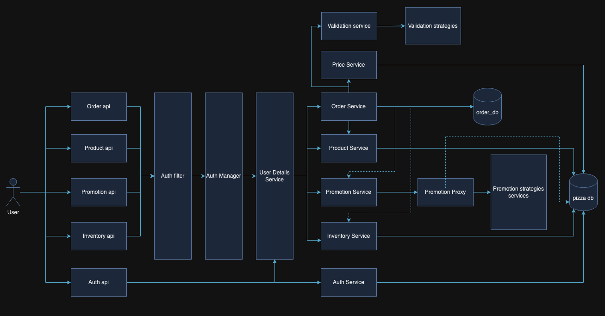
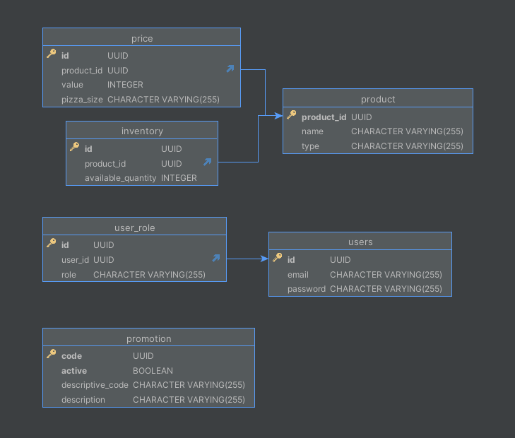

# Pizza Management API

### Description

The pizza api is built based on the assumption that every client can build a pizza from scratch with any components, so there are no ready to deliver pizzas, but the client is the one who chooses how to add up ingredients to the pizza starting with a base.
The base is like the set of ingredients that will definitely create a foundation for the pizza final flavor, let's say Neapolitan base. On the other hand starting with the base, out of this one, **every pizza consists of 1 base, 1 cheese type, and all the additions 
the customer wants to add to the pizza.** The base and the cheese are limited to a quantity of 1 for each type of product. Moreover, the only restriction for the additions is that each of them can be ordered with a limit quantity of 3, so, if a customer wants a peperoni addition, he/she can only order up to 3 additions of peperoni. Of course, the customer is limited
by the available inventory for each type of product. The customer must include the pizza size in the order request so that the price is calculated well, the available sizes are BIG, MEDIUM and SMALL. 
Additionally, one customer can add up a valid promotion code to the order, so that that customer receives any discount on the order; that promotional code must exist and has to be active, otherwise the price fo the order will be calculated without promotional code. All the mentioned ordering operations can be done through the `processOrder` api available in `OrderController`, and only users can order for pizzas.

Regarding inventory, the manager of the business is responsible for filling out inventory, adding up products when needed, and manage the promotions. In order to manage the inventory, there are a set of apis available in `InventoryController` api so that the user can refill inventory when needed and query the inventory for the products so he/she notices of the availability beforehand.

The manager can make use of `ProductController` apis to query for all the products of the business as well as add new products or delete them. To make it clearer every product addition except for bases product types, must include a price for each type of pizza size, it means that it must include an array of price for BIG, MEDIUM, and SMALL pizza, due that it is not the same to add any product for a big pizza than what is for small ones.

Finally, the manager has available the `PromotionController` api, to activate promotions, deactivate any promotion by its id, or query all the available promotions when needed. All the operations in `PromotionController`, `ProductController` and `InventoryController` can only be performed by managers.

In order to recognize any user that wants to perform any operation in the api, there is available an `AuthController` that basically allow any user to get registered and to log in with the respective credentials, that way the api will know which type of user is going to perform which action in the api.

### General Architecture
The architecture is based on a layered architecture. Additionally, to support high concurrent requests from users, an asynchronous non-blocking approach was added to the apis. The api is backed by a postgres sql database.

Here is a glimpse of the general architecture overview:

### Entity relationship diagram

The following diagram shows the modeling of the database, so that it is able to cover the main needs of the api:

### How to use
* Download the api by running this command in the terminal `git clone https://github.com/davidgalvis95/pizza-api`.
* Stand over the root folder of the project - pizza-api - and run `docker-compose up` to start up the pizza api database.
* To connect to the database using some client: The credentials are: `postgres / password` and the database name is `pizza_api_db`.
* Run `mvn clean install`.
* Run the following command `mvn spring-boot:run` to run the api.
* Create any user by calling the `signup` api in the `AuthController`. Only users with roles of type `USER` or `MANAGER` can be created.
* Login with that created user by using the `login` api in the `AuthController`; using the same credentials provided on registration, so that one JWT toked is given back to make further requests.
* Execute any request to the api. All the apis documentation can be found here: http://localhost:9300/webjars/swagger-ui/index.html.
* There is a postman collection on `src/main/resources/postman/Pizza API.postman_collection.json` so that there's an idea of how do the requests look like.

